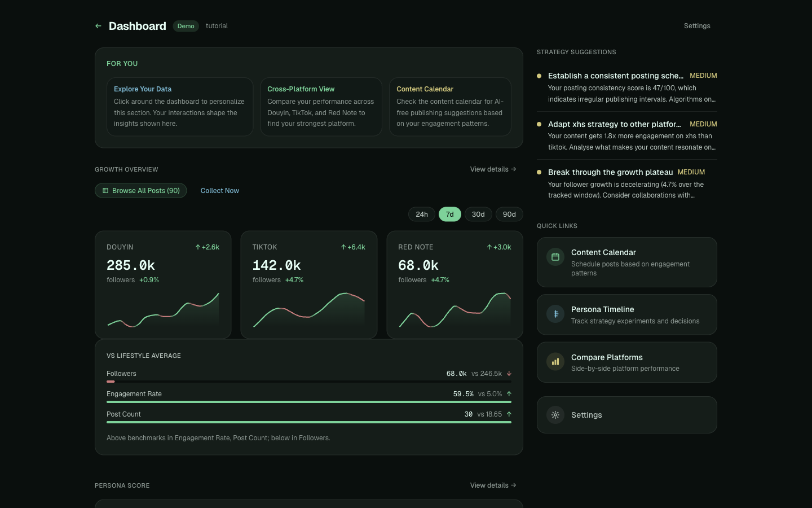
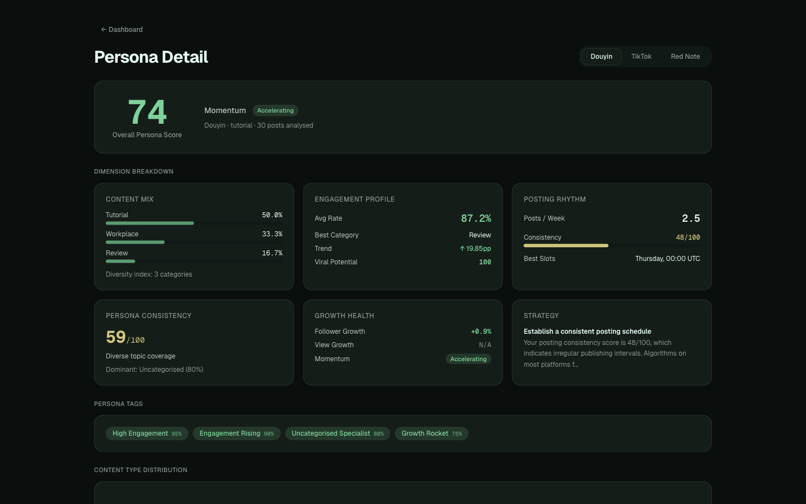
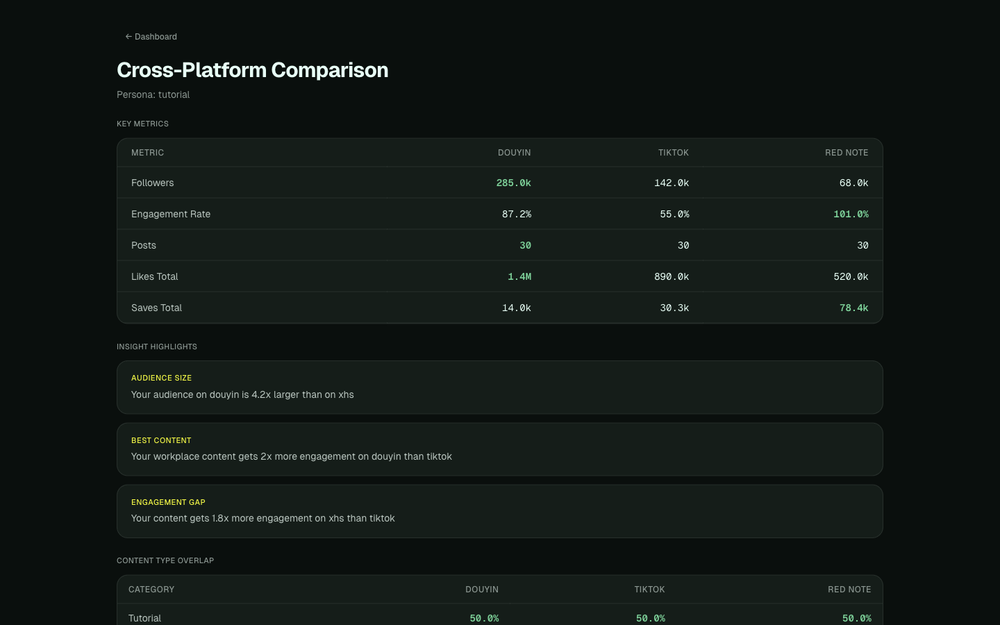

# DashPersona

**Understand your creator persona across Douyin, TikTok, and Red Note — with zero AI.**

[](./CHANGELOG.md)
[](./LICENSE)
[](https://nextjs.org/)
[](https://www.typescriptlang.org/)
[](https://vercel.com/)
[](https://github.com/EverMind-AI/EverMemOS)

<p align="center">
  <a href="https://www.youtube.com/watch?v=XwvHWx6m6dw">
    
  </a>
  <br />
  <sub><b>Watch the demo →</b></sub>
</p>

<p align="center">
  <a href="https://dash-persona.vercel.app"><strong>Try the live demo →</strong></a>
</p>

---

## The Problem

Content creators manage multiple platforms but have no unified view of their performance. Each platform's analytics lives in a silo, metrics aren't comparable, and most "analytics tools" are either expensive SaaS products or black-box AI that can't explain its recommendations.

## How DashPersona Solves It

DashPersona ingests your creator data from **Douyin**, **TikTok**, and **Red Note**, normalizes it into a unified schema, and runs it through **11 deterministic analysis engines**. Every score, tag, and recommendation is computed with transparent algorithms — no LLM calls, no API keys, no subscription fees. You can trace any number back to the formula that produced it.

---

## Two Ways to Use DashPersona

### Web Demo — Try it instantly

Visit [dash-persona.vercel.app](https://dash-persona.vercel.app) and click **Try Demo** to explore with built-in sample data. No login, no setup. You can also upload your own XLSX/JSON exports from Creator Centers to see real analysis — but the web version is limited to file-based data.

### Full Version — Collect real-time data from your Creator Centers

Install the CLI for automatic data collection directly from your Chrome browser. Supports Douyin, TikTok, and Red Note creator centers using your existing login sessions.

```bash
npm install -g @anthropic-ai/claude-code
claude skill install --global github.com/eze-is/web-access
```

> **New to the command line?** Follow the [step-by-step installation guide](https://dash-persona.vercel.app/install) — designed for complete beginners with no programming experience.

| | Web Demo | Full Version (CLI) |
|---|---|---|
| Sample data exploration | Yes | Yes |
| File import (XLSX/JSON/CSV) | Yes | Yes |
| Real-time CDP data collection | — | Yes |
| Trending topic analysis | — | Yes |
| Persistent data across sessions | — | Yes |
| All 11 analysis engines | Yes | Yes |

---

## See It in Action

### Dashboard — Your command center

Growth sparklines, cross-platform follower deltas, niche benchmarking, and strategy suggestions — all on one screen.

<p align="center">
  
</p>

### Persona Score — Know your strengths

A composite 0–100 score breaking down your content mix, engagement rate, posting rhythm, persona consistency, growth health, and viral potential. Click any dimension to see the exact formula.

<p align="center">
  
</p>

### Cross-Platform Comparison — Find your best platform

Side-by-side metrics across all your platforms. Automatically surfaces insights like "your audience on Douyin is 4.2x larger than on Red Note" and "your content gets 1.8x more engagement on Red Note than TikTok."

<p align="center">
  
</p>

---

## Key Features

### Analysis

| Feature | What it does |
|---------|-------------|
| **Persona Score** | Composite 0–100 score across 6 dimensions with explainable formulas |
| **Niche Detection** | Auto-detects your niche from 10 benchmark categories with confidence scores |
| **Strategy Engine** | Actionable recommendations based on your actual engagement patterns |
| **Content Calendar** | AI-free publishing schedule optimized from your best-performing time slots |
| **Persona Timeline** | Decision tree for tracking strategy experiments and pivots |
| **Next Content Engine** | 7 deterministic rules combining persona data with trending analysis for content suggestions |
| **Cross-Platform** | Unified radar comparison across Douyin, TikTok, and Red Note |

### Data Collection

| Feature | What it does |
|---------|-------------|
| **CDP Collection** | Collect posts, followers, and engagement from Creator Centers via Chrome DevTools Protocol |
| **File Import** | Drag-and-drop XLSX, CSV, JSON — auto-detects 4 Douyin + 7 TikTok export schemas |
| **Persistent Storage** | IndexedDB-backed profiles survive browser sessions — import once, analyze forever |
| **Data Passport** | Chrome extension for one-click Douyin data capture |
| **Trending Analysis** | Real-time search and hot topic collection from XHS and TikTok |

### Output

| Feature | What it does |
|---------|-------------|
| **Growth Tracking** | Historical snapshots with sparkline charts — 24h/7d/30d/90d time ranges |
| **Report Export** | Export dashboard as PNG, PDF, or CSV |
| **Analysis Delta** | Track changes between analysis runs — see what improved |

---

## Quick Start

```bash
git clone https://github.com/Fearvox/dash-persona.git
cd dash-persona
npm install
npm run dev
```

Open [localhost:3000](http://localhost:3000) and click **Try Demo** to explore with sample data.

For real data collection, see the [installation guide](https://dash-persona.vercel.app/install).

---

## How It Works

```
  Your Data                    Analysis Engines                  What You See
 ───────────                  ──────────────────                ──────────────
 CDP proxy (Douyin,           ┌─ Persona Score                  Dashboard
   TikTok, XHS) ──┐          ├─ Growth Tracker                 Persona Detail
 JSON / CSV ───────┤          ├─ Niche Detection                Compare View + Radar
 XLSX (11 schemas) ┼─ Schema ─┼─ Niche Benchmark                Content Calendar
 Chrome extension ─┤  Check   ├─ Strategy Engine                Persona Timeline
 Manual import ────┘    │     ├─ Content Planner                Pipeline View
                    Profile   ├─ Cross-Platform Comparator      Export (PNG/PDF/CSV)
                    Store     ├─ Idea Generator
                  (IndexedDB) ├─ Content Analyzer
                              └─ Next Content Engine
```

**All engines are deterministic.** Same input always produces the same output. No randomness, no model weights, no external API calls.

### Under the Hood

- **Content classification** — inverted-index keyword matching across 31 categories
- **Engagement scoring** — weighted formula (comments x5, shares x3, saves x2) modelled on production ranking systems
- **Persona consistency** — sliding-window cosine similarity between content periods
- **Niche detection** — maps content distribution to 10 benchmark niches with synthetic cohort comparison
- **Growth analysis** — delta computation over IndexedDB-persisted historical snapshots
- **Engine memoization** — FNV-1a content hashing with LRU eviction (maxSize=64)
- **XLSX schema detection** — auto-classifies 11 export formats (4 Douyin + 7 TikTok Studio) with year-boundary date normalization
- **Profile persistence** — IndexedDB storage with sessionStorage sync cache, merge-on-import for cross-session data retention

### Architecture

```
src/lib/engine/         — 11 analysis engines (persona, growth, niche, benchmark, strategy, planner, comparator, ideas, explain, content-analyzer, next-content)
src/lib/adapters/       — 7 data adapters (CDP, Demo, FileImport, Manual, Extension, HTMLParse, Browser)
src/lib/store/          — IndexedDB profile persistence with sessionStorage sync
src/lib/collectors/     — CDP client, trending collector, video analyzer, temp storage
src/app/api/            — CDP collection + trending endpoints
src/app/install/        — Beginner-friendly CLI setup guide
src/app/onboarding/     — Multi-mode data import wizard (file upload, URL paste, CDP auto-collect)
```

---

## Data Adapters

| Adapter | Platform | How it works | Status |
|---------|----------|-------------|--------|
| `CDPAdapter` | Douyin, TikTok, XHS | Collects via Chrome DevTools Protocol using existing login sessions | Stable |
| `FileImportAdapter` | Douyin, TikTok | XLSX/CSV/JSON import with 11-schema auto-detection and merge | Stable |
| `DemoAdapter` | Any | Built-in sample profiles for instant exploration | Stable |
| `ManualImportAdapter` | Any | Upload JSON data with schema validation | Stable |
| `ExtensionAdapter` | Douyin | Receives live data from Data Passport extension | Beta |
| `HTMLParseAdapter` | TikTok, Douyin, Red Note | Parses exported HTML from platform pages | Fallback |
| `BrowserAdapter` | Douyin, TikTok, XHS | Headless browser automation | Fallback |

> **Fallback adapters:** `HTMLParseAdapter` and `BrowserAdapter` are retained as fallback options. Use `CDPAdapter` for reliable platform data collection.

---

## Tech Stack

| | Technology |
|---|---|
| Framework | Next.js 16 (App Router) |
| Language | TypeScript 5 (strict) |
| UI | React 19 + Tailwind CSS 4 |
| Charts | Recharts 3 |
| Testing | Vitest + Playwright |
| Client Storage | IndexedDB + sessionStorage |
| Extension | Chrome MV3 + Vite |
| Deploy | Vercel |

---

## Why This Matters

### For Creators

China's creator economy exceeds **1.5 trillion RMB** annually, but individual creators still fly blind. Platform analytics are siloed, metrics aren't comparable, and third-party tools charge monthly subscriptions for black-box outputs. DashPersona gives every creator a transparent, self-hosted intelligence engine — at zero cost.

### Built with EverMemOS

DashPersona was built across **20+ sessions** using [EverMemOS](https://github.com/EverMind-AI/EverMemOS) as the persistent memory layer for AI-assisted development. EverMemOS is an open-source structured memory system for AI coding agents — it automatically captures architectural decisions, sprint plans, and debugging context into a queryable knowledge base.

This project is a living case study: 11 analysis engines, 7 data adapters, a Chrome extension, and a cinematic landing page — all designed across separate sessions but maintaining consistent interfaces. Architecture decisions made in Session 1 were correctly recalled and enforced in Session 20. Every non-obvious choice is traceable through structured memory.

> **11 analysis engines. 7 data adapters. 15 E2E tests. 189 unit tests. 1 Chrome extension. Zero context lost between sessions.**

---

## Roadmap

- [x] Niche-aware benchmarking (10 niches, synthetic cohort comparison)
- [x] Browser extension for one-click Douyin data capture
- [x] Client-side history persistence (IndexedDB)
- [x] Platform-specific quality signals (completion rate, bounce rate, watch duration)
- [x] Multi-file import with 4 Douyin XLSX schema auto-detection
- [x] Radar chart multi-dimensional cross-platform comparison
- [x] Report export as PNG and PDF
- [x] Engine memoization with FNV-1a content hashing and LRU eviction
- [x] E2E test coverage with Playwright (15 test cases across 5 core flows)
- [x] Accessibility: focus-visible, skip-to-content, semantic landmarks, keyboard navigation
- [x] CDP-based data collection for Douyin, TikTok, and XHS
- [x] Trending analysis with real-time topic collection
- [x] Next Content Engine with 7 deterministic suggestion rules
- [x] Content structure analysis with video frame extraction
- [x] Enhanced onboarding wizard with CDP proxy setup and platform login verification
- [x] Temp data management with automatic 15-day expiry and 500MB cap
- [x] CSV export for dashboard data
- [x] Analysis delta tracking (change detection between analysis runs)
- [x] TikTok Studio XLSX import (7 additional schema types with date normalization)
- [x] Persistent profile storage (IndexedDB with merge-on-import)
- [x] Demo/real data separation across all detail pages
- [x] CLI installation guide for non-technical users
- [ ] i18n support (Chinese)

---

## Changelog

See [CHANGELOG.md](./CHANGELOG.md) for a detailed version history.

---

## Contributing

1. Fork the repo and create a feature branch from `main`
2. `npm install` → `npm run dev`
3. Make your changes, ensure `npm run build` passes
4. Open a PR with a clear description

---

## License

**Business Source License 1.1 (BSL 1.1)**

- Source available — read, fork, and modify freely
- Non-production use permitted without a license
- Production use requires a commercial license from [Fearvox](mailto:nolan@openclaw.dev)
- Converts to **Apache 2.0** on 2030-03-24

See [LICENSE](./LICENSE) for the full text.
