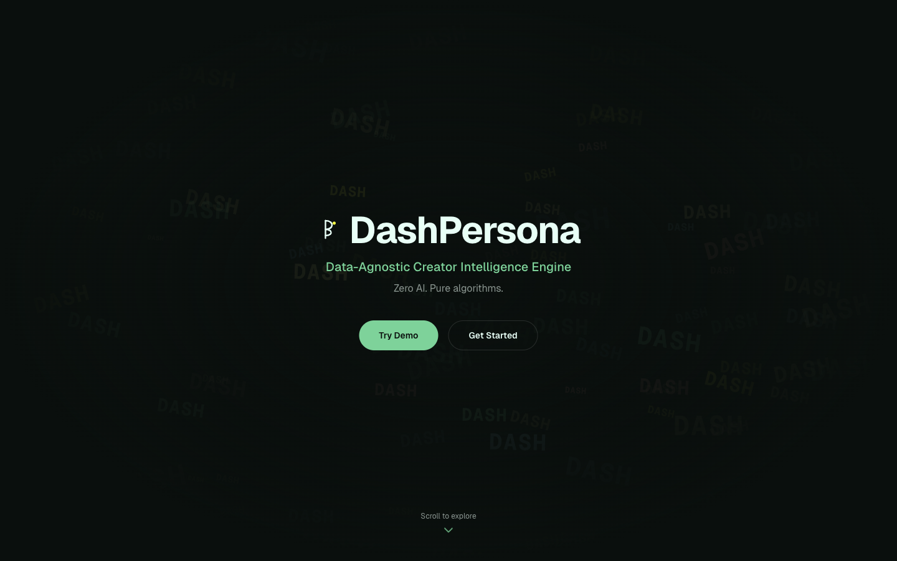

# DashPersona

**Understand your creator persona across Douyin, TikTok, and Red Note — with zero AI.**

[](./LICENSE)
[](https://nextjs.org/)
[](https://www.typescriptlang.org/)
[](https://vercel.com/)

<p align="center">
  <a href="https://dash-persona.vercel.app"><strong>Try the live demo →</strong></a>
</p>

<p align="center">
  
</p>

---

## The Problem

Content creators manage multiple platforms but have no unified view of their performance. Each platform's analytics lives in a silo, metrics aren't comparable, and most "analytics tools" are either expensive SaaS products or black-box AI that can't explain its recommendations.

## How DashPersona Solves It

DashPersona ingests your creator data from **Douyin**, **TikTok**, and **Red Note**, normalizes it into a unified schema, and runs it through **6 deterministic analysis engines**. Every score, tag, and recommendation is computed with transparent algorithms — no LLM calls, no API keys, no subscription fees. You can trace any number back to the formula that produced it.

---

## See It in Action

### Dashboard — Your command center

Growth sparklines, cross-platform follower deltas, niche benchmarking, and strategy suggestions — all on one screen.

<p align="center">
  
</p>

### Persona Score — Know your strengths

A composite 0–100 score breaking down your content mix, engagement rate, posting rhythm, persona consistency, growth health, and viral potential. Click any dimension to see the exact formula.

<p align="center">
  
</p>

### Cross-Platform Comparison — Find your best platform

Side-by-side metrics across all your platforms. Automatically surfaces insights like "your audience on Douyin is 4.2× larger than on Red Note" and "your content gets 1.8× more engagement on Red Note than TikTok."

<p align="center">
  
</p>

---

## Key Features

| Feature | What it does |
|---------|-------------|
| **Persona Score** | Composite 0–100 score across 6 dimensions with explainable formulas |
| **Niche Benchmarking** | Auto-detects your niche, compares you against 10 category-specific cohorts |
| **Growth Tracking** | Historical snapshots stored locally — track followers, likes, and videos over time |
| **Strategy Engine** | Actionable recommendations based on your actual engagement patterns |
| **Content Calendar** | AI-free publishing schedule optimized from your best-performing time slots |
| **Persona Timeline** | Decision tree for tracking strategy experiments and pivots |
| **Data Passport** | Chrome extension that captures Douyin creator data in one click |
| **Cross-Platform** | Unified view across Douyin, TikTok, and Red Note |

---

## Quick Start

```bash
git clone https://github.com/Fearvox/dash-persona.git
cd dash-persona
npm install
npm run dev
```

Open [localhost:3000](http://localhost:3000) and click **Try Demo** to explore with built-in sample data — no login, no API keys, no setup.

---

## How It Works

```
  Your Data                    Analysis Engines                  What You See
 ───────────                  ──────────────────                ──────────────
 Douyin profile ──┐
 TikTok export ───┤           ┌─ Persona Score                  Dashboard
 Red Note data ───┼── Schema ─┼─ Growth Tracker                 Persona Detail
 JSON / CSV ──────┤   Check   ├─ Niche Benchmark                Compare View
 Chrome extension ┘           ├─ Strategy Engine                Content Calendar
                              ├─ Content Planner                Persona Timeline
                              └─ Cross-Platform Comparator      Pipeline View
```

**All engines are deterministic.** Same input always produces the same output. No randomness, no model weights, no external API calls.

### Under the Hood

- **Content classification** — inverted-index keyword matching across 31 categories
- **Engagement scoring** — weighted formula (comments ×5, shares ×3, saves ×2) modelled on production ranking systems
- **Persona consistency** — sliding-window cosine similarity between content periods
- **Niche detection** — maps content distribution to 10 benchmark niches with synthetic cohort comparison
- **Growth analysis** — delta computation over IndexedDB-persisted historical snapshots

---

## Data Adapters

| Adapter | Platform | How it works | Status |
|---------|----------|-------------|--------|
| `DemoAdapter` | Any | Built-in sample profiles for instant exploration | Stable |
| `HTMLParseAdapter` | TikTok | Parses exported HTML from TikTok | Experimental |
| `ManualImportAdapter` | Any | Upload your own JSON data | Stable |
| `ExtensionAdapter` | Douyin | Receives live data from Data Passport extension | Beta |

Want to add a new platform? Implement the `DataAdapter` interface and register it:

```ts
import { registerAdapter } from '@/lib/adapters';
registerAdapter(new YourAdapter());
```

---

## Tech Stack

| | Technology |
|---|---|
| Framework | Next.js 16 (App Router) |
| Language | TypeScript 5 (strict) |
| UI | React 19 + Tailwind CSS 4 |
| Charts | Recharts 3 |
| Client Storage | IndexedDB |
| Extension | Chrome MV3 + Vite |
| Deploy | Vercel |

---

## Roadmap

- [x] Niche-aware benchmarking (10 niches, synthetic cohort comparison)
- [x] Browser extension for one-click Douyin data capture
- [x] Client-side history persistence (IndexedDB)
- [x] Platform-specific quality signals (completion rate, bounce rate, watch duration)
- [ ] Red Note and TikTok live adapters
- [ ] Continuous background data collection via extension
- [ ] Export reports as PDF / shareable link
- [ ] i18n support (Chinese)

---

## Contributing

1. Fork the repo and create a feature branch from `main`
2. `npm install` → `npm run dev`
3. Make your changes, ensure `npm run build` passes
4. Open a PR with a clear description

---

## License

**Business Source License 1.1 (BSL 1.1)**

- Source available — read, fork, and modify freely
- Non-production use permitted without a license
- Production use requires a commercial license from [Fearvox](mailto:nolan@openclaw.dev)
- Converts to **Apache 2.0** on 2030-03-24

See [LICENSE](./LICENSE) for the full text.
